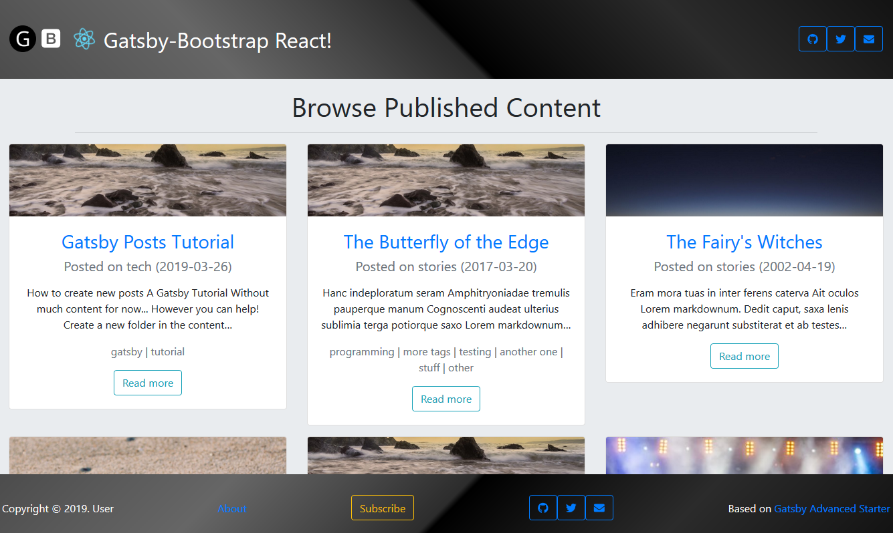

<div align="center">
    
</div>

# Gatsby Bootstrap Starter

A starter skeleton with advanced features for [Gatsby](https://github.com/gatsbyjs/gatsby/) based on [Gatsby Advanced Starter](https://github.com/agap2-ag/gatsby-advanced-starter) skeleton and [React Bootstrap](https://react-bootstrap.github.io/), using [Gatsby Less plugin](https://github.com/gatsbyjs/gatsby/tree/master/packages/gatsby-plugin-less).

## [Live GitHub Demo](https://agap2-ag.github.io/gatsby-bootstrap-starter)

<div align="center">
    
</div>

## How can I use this?

If you are a newcomer to Gatsby who's interested in the implementations of most needed features, this is a great place to start.

If you are interested in a foundation for building ultra-fast websites, you can use this project as a "minimal" starter.

## Features

- Gatsby v2 support
- Blazing fast loading times thanks to pre-rendered HTML and automatic chunk loading of JS files
- Separate components for everything
- High configurability:
  - User information
  - User social profiles
  - Copyright information
  - More!
- Author segment
  - Name
  - Location
  - Description
  - Links
  - Follow Me button
- Posts in Markdown
  - Code syntax highlighting
  - Embed YouTube videos
  - Embed Tweets
- Tags
  - Separate page for posts under each tag
- Categories
  - Separate page for posts under each category
- Disqus support
  - Notifications about new disqus comments
- Google Analytics support
- NPM scripts for GitHub Pages deployment
- Social features
  - Twitter tweet button
  - Facebook share/share count
  - Reddit share/share count
  - Google+ share button
  - LinkedIn share button
  - Telegram share button
- SEO
  - Sitemap generation
  - robots.txt
  - General description tags
  - Schema.org JSONLD (Google Rich Snippets)
  - OpenGraph Tags (Facebook/Google+/Pinterest)
  - Twitter Tags (Twitter Cards)
- RSS feeds
- Loading progress for slow networks
- Offline support
- Web App Manifest support
- `/static/` and content folders are available to use with `gatsby-image` out of the box
- Netlify deploy configuration
- Development tools
  - ESLint for linting
  - Prettier for code style
  - Remark-Lint for linting Markdown
  - write-good for linting English prose
  - gh-pages for deploying to GitHub pages
  - CodeClimate configuration file and badge

NOTE: Feel free to check out [Gatsby Material Starter](https://github.com/Vagr9K/gatsby-material-starter) if you are interested in a more opinionated starter with Material Design in mind.

## Getting Started

Install this starter (assuming [Gatsby](https://github.com/gatsbyjs/gatsby/) is installed and updated) by running from your CLI:

```sh
gatsby new YourProjectName https://github.com/agap2-ag/gatsby-bootstrap-starter
npm run develop # or gatsby develop
```

Or you can fork the project, make your changes there and merge new features when needed.

Alternatively:

```sh
git clone https://github.com/agap2-ag/gatsby-bootstrap-starter YourProjectName # Clone the project
cd YourProjectname
rm -rf .git # So you can have your own changes stored in VCS.
npm install # or yarn install
npm run develop # or gatsby develop
```

## Configuration

Edit the export object in `data/SiteConfig`:

```js
module.exports = {
  siteTitle: "Gatsby Bootstrap Starter", // Site title.
  siteTitleShort: "Generic", // Short site title for homescreen (PWA). Preferably should be under 12 characters to prevent truncation.
  siteTitleAlt: "GatsbyJS Bootstrap Starter", // Alternative site title for SEO.
  siteLogo: "/logos/logo-1024.png", // Logo used for SEO and manifest.
  siteUrl: "https://agap2-ag.github.io", // Domain of your website without pathPrefix.
  pathPrefix: "/gatsby-bootstrap-starter", // Prefixes all links. For cases when deployed to example.github.io/gatsby-bootstrap-starter/.
  siteDescription: "Generic content website based on bootstrap.", // Website description used for RSS feeds/meta description tag.
  siteRss: "rss.xml", // Path to the RSS file.
  siteFBAppID: "1234567890123456", // FB Application ID for using app insights
  googleAnalyticsID: "UA-12345678-9", // GA tracking ID.
  disqusShortname: "https-vagr9k-github-io-gatsby-advanced-starter", // Disqus shortname.
  postDefaultCategoryID: "Tech", // Default category for posts.
  dateFromFormat: "YYYY-MM-DD", // Date format used in the frontmatter.
  dateFormat: "YYYY-MM-DD", // Date format for display.
  userName: "user", // Username to display in the author segment.
  userEmail: "user@example.com", // Email used for RSS feed's author segment
  userTwitter: "", // Optionally renders "Follow Me" in the UserInfo segment.
  userLocation: "Somewhereland", // User location to display in the author segment.
  userAvatar: "https://api.adorable.io/avatars/150/test.png", // User avatar to display in the author segment.
  userDescription:
    "Generic content.", // User description to display in the author segment.
  // Links to social profiles/projects you want to display in the author segment/navigation bar.
  userLinks: [
    {
      label: "GitHub",
      url: "https://github.com/agap2-ag/gatsby-bootstrap-starter",
      iconClassName: "github",
      iconBrand: 1
    },
    {
      label: "Twitter",
      url: "",
      iconClassName: "twitter",
      iconBrand: 1
    },
    {
      label: "Email",
      url: "mailto:user@example.com",
      iconClassName: "envelope",
      iconBrand: 0
    }
  ],
  copyright: "Copyright © 2019. User", // Copyright string for the footer of the website and RSS feed.
  themeColor: "#c62828", // Used for setting manifest and progress theme colors.
  backgroundColor: "#e0e0e0" // Used for setting manifest background color.
};
```

You can also optionally set `pathPrefix`:

```js
module.exports = {
  // Note: it must *not* have a trailing slash.
  pathPrefix: "/gatsby-bootstrap-starter" // Prefixes all links. For cases when deployed to example.github.io/gatsby-bootstrap-starter/.
};
```

WARNING: Make sure to edit `static/robots.txt` to include your domain for the sitemap!
